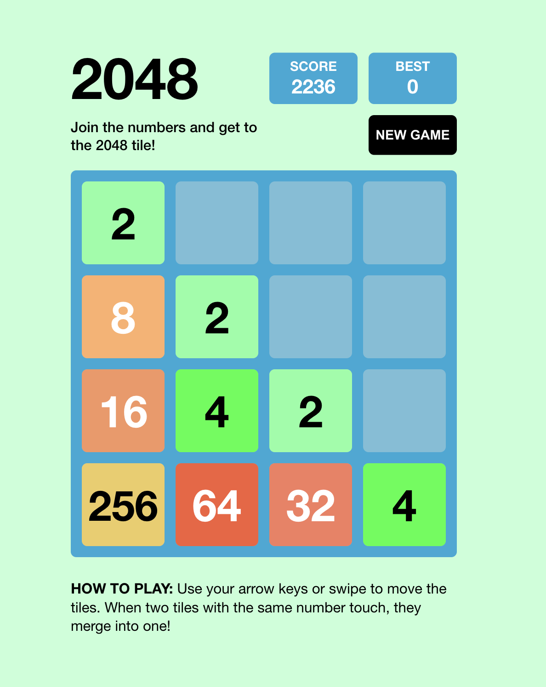

# 2048

This is a React implementation of the [2048](<https://en.wikipedia.org/wiki/2048_(video_game)>) game.

Play the game [here]().



## Development environment

1. Clone the repository:

```
git clone https://github.com/rachitk05/2048-Game.git
```

2. Change directory:

```
cd 2048-Game
```

3. Run the application:

```
$ npm install
$ npm start
```

4. The application will be running on [localhost:3000]()
